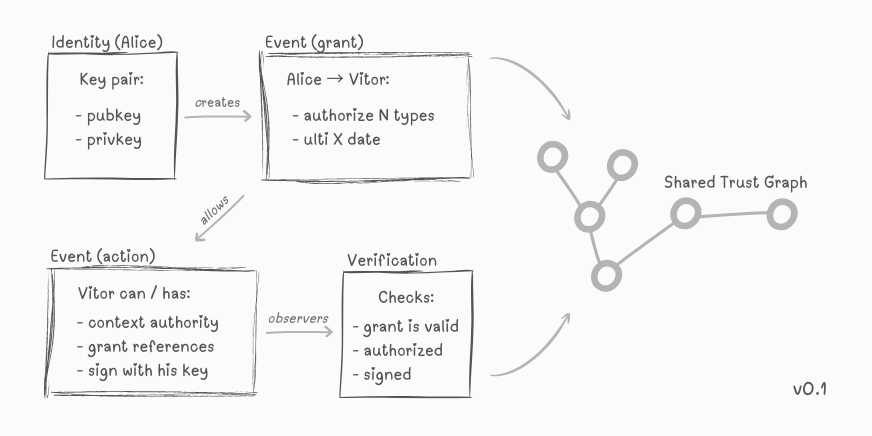

# 🕸️ LIBYS Protocol


> A protocol for sovereign, portable reputation built from verifiable interactions between cryptographic identities.



---

## ⚡ TL;DR
LIBYS turns interactions into a trust graph:

- identities = Ed25519 keypairs
- actions = signed events
- authority = expressed via delegation (no key sharing)
- reputation = derived from graph structure

> Trust is not assigned. It is accumulated.

### 💡 Why this exists
Today:
- identity is cheap to recreate
- reputation is locked inside platforms
- trust is centralized and non-portable

The protocol separates:
- identity
- authority
- reputation

> So trust can emerge **without a central owner**.

## 🧠 Core Model
At its simplest form:

```
(identity) --[signed event]--> (subject)
```

With delegation:

```
(identity A) --[system.auth.grant]--> (identity B)  
(identity B) --[delegated event]--> (subject)
```

- users can delegate authority to apps
- applications can delegate authority to users
- services can delegate to other services

> There is no distinction between “user” and “application” at the protocol level.

## 🔍 Reputation Model (Out of Scope)

The protocol does **not** define how reputation is calculated. Reputation is derived by observers analyzing the trust graph according to their own criteria.

This may include:
- interaction history
- delegation chains
- graph connectivity
- cluster detection or filtering

> LIBYS defines verifiable data, not subjective interpretation. Different observers may reach different conclusions from the same data.

## 📄 Whitepaper
The full technical specification is available in [`WHITEPAPER.pdf`](./WHITEPAPER.pdf).

## 🧩 Use Cases
Examples enabled by LIBYS:

- portable reputation: carry trust across platforms
- brokerless marketplaces: P2P trade based on history
- scoped DAO governance: delegated authority via `system.auth.grant`
- sybil-resistant social: structural cost for identity reset
- autonomous agent trust: secure M2M delegation

## 📦 Proof of Concept (PoC)
This repository includes a minimal Java implementation demonstrating:
- identity creation
- event signing
- delegation flow
- verification
 
### Prerequisites
- Java 17+ & Maven
- `jq` and `xxd` (for the demo script)

### Quick Start
To see the protocol in action, run the automated demo:

```bash
chmod +x poc/demo.sh
./poc/demo.sh
```

### Manual Testing
You can interact with the CLI directly. Detailed examples of commands are available in [poc/NOTES.md](./poc/NOTES.md).

## ⭐ Support the Project
If this idea resonates, give the repo a star.
 
## 📄 License
Distributed under the [MIT License](./LICENSE).